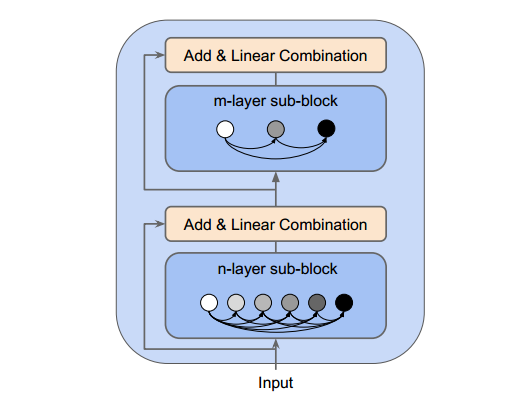
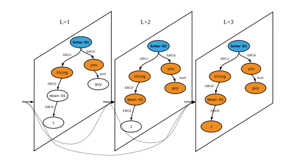

# Densely Connected Graph Convolutional Networks for Graph-to-Sequence Learning

This paper/code introduces the Densely Connected Graph Convolutional Networks (DCGCNs) for the graph-to-sequence learning task. We evaluate our model on two tasks including AMR-to-Text Generation (AMR2015 and AMR2017) and Syntax-Based Machine Translation (EN2DE and EN2CS).

You can find the latest version of the TACL paper [here](http://www.statnlp.org/wp-content/uploads/2019/03/DCGCN.pdf).

This paper is presented in ACL 2019, you can find the video [here](http://www.acl2019.org/EN/program.xhtml) in Session 6F: Machine Learning 4. Slides are also available (under the images directory) for brief introduction of this work.

See below for an overview of the encoder (DCGCNs) architecture: Each DCGCN block has two sub-blocks. Both of them are densely connected graph convolutional layers with different numbers (**n** & **m**) of layers. For these two tasks we use **n=6** and **m=3**. These are hyper-parameters. 



The densely connected graph convolutional layers are inspired by [DenseNets](https://arxiv.org/abs/1608.06993) and defined as follows: Here we use an AMR graph as an example.




## Dependencies
The model requires:
- Python3
- [MXNet 1.3.0](https://github.com/apache/incubator-mxnet/tree/1.3.0)
- [Sockeye 1.18.56(NMT framework based on MXNet)](https://github.com/awslabs/sockeye)
- CUDA (we tested on CUDA 9.2)

## Installation
#### GPU

If you want to run sockeye on a GPU you need to make sure your version of Apache MXNet
Incubating contains the GPU bindings. Depending on your version of CUDA you can do this by running the following:

```bash
> pip install -r requirements/requirements.gpu-cu${CUDA_VERSION}.txt
> pip install .
```
where `${CUDA_VERSION}` can be `75` (7.5), `80` (8.0), `90` (9.0), `91` (9.1), or `92` (9.2).

## Preprocessing

We need to convert the dataset into extended Levi graphs for training. For details please refer to the paper.

TODO

## Training

To train the DCGCN model, run (here we use AMR2015 as an example):

```
./train_amr15.sh
```

Model checkpoints and logs will be saved to `./sockeye/amr2015_model`.

## Decoding

When we finish the training, we can use the trained model to decode on the test set, run:

```
./decode_amr15.sh
```

This will use the last checkpoint (84th for AMR2015) by default. Use `--checkpoints` to specify a model checkpoint file.

## Postprocessing

For AMR-to-Text generation, we also use the scope markers as in [Konstas et al. (2017)](https://arxiv.org/pdf/1704.08381.pdf) and [Beck et al. (2018)](https://arxiv.org/pdf/1806.09835.pdf). Basically, they conduct named entity anonymization and named entity clustering in the preprocessing stage.
In the postprocessing state, we need to substitute the anonymized entities, run:

```
./postprocess_amr.sh

```

For Syntax-Based Machine Translation, we use BPE in the decoder side. In the postprocessing stage, we need to merge them into natural language sequence for evaluation. 

TODO

## Evaluation

For BLEU score evaluation, run:

```
./eval_bleu.sh

```

## Citation
```
@article{guo-etal-2019-densely,
    title = "Densely Connected Graph Convolutional Networks for Graph-to-Sequence Learning",
    author = "Guo, Zhijiang and Zhang, Yan and Teng, Zhiyang and Lu, Wei",
    journal = "Transactions of the Association for Computational Linguistics",
    volume = "7",
    month = mar,
    year = "2019",
    url = "https://www.aclweb.org/anthology/Q19-1019",
    pages = "297--312"
}
```


## Related Repo

This repo is built based on [Graph-to-Sequence Learning using Gated Graph Neural Networks](https://github.com/beckdaniel/acl2018_graph2seq).
DCGCNs can also be applied on other NLP tasks. For example, relation extraction: [Attention Guided Graph Convolutional Networks for Relation Extraction](https://github.com/Cartus/AGGCN_TACRED).


## Results

We also release the output of our model. Please refer to the **results** directory.

## Pretrained Models

We will released our 4 pretrained models on AMR2015, AMR2017, EN2DE and EN2CS datasets.

TODO

## Hyper-Parameters

The remaining new options are related to the DCGCNs, which was abbreviated it as `gcn` in the API. Here is a list of options to train our model:

`--source`: path to the file of the source sentences of the training set.

`--target`: path to the file of the target sentences of the training set.

`--source-graphs`: path to the graph information file of the training set.

`--validation-source`: path to the file of the source sentences of the validation set.

`--validation-target`: path to the file of the target sentences of the validation set.

`--val-source-graphs`: path to the graph information file of the validation set.

`--edge-vocab`: path to the file of edge vocabulary.

`--batch-size`: for AMR generation task, we usually set it to 16. For NMT task, we usually set it to 24.

`--batch-type`: sentence.

`--word-min-count`: for AMR generation task, we usually set it to 2:2. For NMT task, it should be 3:3. This is the minimum frequency of words to be included in vocabularies.

`--num-embed`: for both tasks, we set it to 300:300. It is the embedding size for source and target tokens.

`--gcn-pos-embed`: for both tasks, we set it to 300. It is the dimensionality of positional embeddings. We concat it with the word embeddings.

`--embed-dropout`: for both tasks, we set it to 0.5:0.5. It is the dropout probability for source and target embeddings.

`--shared-vocab`: for both task, we share the source and target vocabulary.

`--max-seq-len`: for AMR generation task, we set it to 199:199 (the Sockeye framework needs to take BOS and EOS symbols into consideration, the totol length should be 200:200). It is the maximum sequence length in terms of number of tokens.

`--encoder`: we use gcn here, which is our densely connected graph convolutional network.

`--gcn-activation`: type activation to use for each graph convolutional layer. For both tasks, we use relu.

`--gcn-num-hidden`: for both tasks, we set it to 360. It is the number of DCGCN hidden units.

`--gcn-dropout`: for both tasks, we set it to 0.1. Dropout rate on the DCGCN output vectors.

`--gcn-adj-norm`: this flag enables normalisation when updating each node hidden state.

`--num-layers`: for AMR generation task, we set it to 4:1, which means we stacked four densely connected graph convolutional layers for the encoder side and one LSTM layer for the decoder side. For NMT task, we set it to 3:2.

`--decoder`: we used LSTM for both tasks.

`--rnn-attention-type`: we use coverage attention for both tasks. 

`--rnn-num-hidden`: we set it to 300 for both tasks.

`--rnn-decoder-hidden-dropout`: we set it to 0.2 for both tasks.

`--weight-tying`: turn on weight tying for both tasks.

`--weight-tying-type`: we used src_trg here.

`--weight-init-xavier-factor-type`: we used in as the default type.

`--weight-init-scale`: weight initialization scale for xavier initialization. We set it to 2.34.

`--initial-learning-rate`: for AMR generation task, we set it to 0.0003.

`--learning-rate-reduce-factor`: we use plateau-reduce as the default learning rate scheduler. Here we set the factor to multiply learning rate with to be 0.7.

`--learning-rate-reduce-num-not-improved`: for plateau-reduce learning rate scheduler. Adjust learning rate if perplexity did not improve for 5 checkpoints.

`--checkpoint-frequency`: checkpoint and evaluate every 1000 updates/batches for AMR generation, 1500 for NMT task.

`--max-num-checkpoint-not-improved`: maximum number of checkpoints the model is allowed to not improve in perplexity on validation data before training is stopped. Here we set it to 28.

`--decode-and-evaluate`: decode certain number of (-1 means all) sampled sentences from validation data and compute evaluation metrics.

`--output`: file to write parameters.

`--overwrite-output`: delete all contents of the model directory if it already exists.

`--device-ids`: List or number of GPUs ids to use.

`--keep-last-params`: keep only the last 30 params files.

`--fixed-param-names`: we fix the embedding while finetuning the model on the gold training data (for external dataset pretraining).

Here is a list of options to use the saved model to decode:

`-m`: path to the folder of the saved model.

`--edge-vocab`: path to the file of edge vocabulary.

`-o`: path to the file of the input sentences.

`--beam-size`: size of the beam search, we use 10 for both task.

`--checkpoints`: you can select a specific checkpoint for decoding. Otherwise, the system will choose the best checkpoint (in terms of perplexity on validation set) for decoding.


